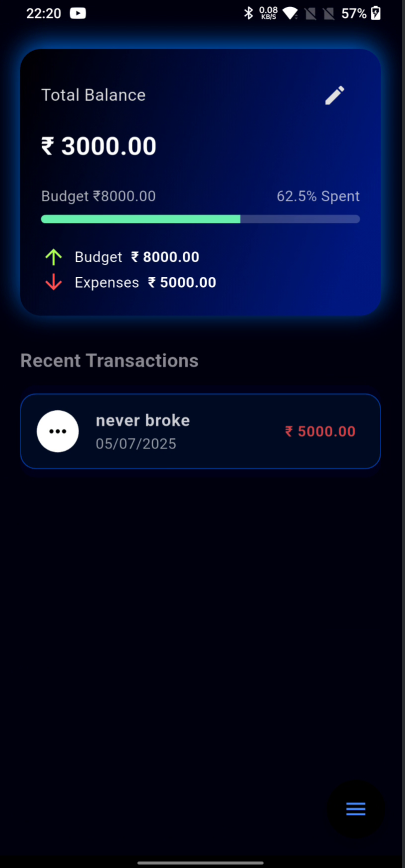
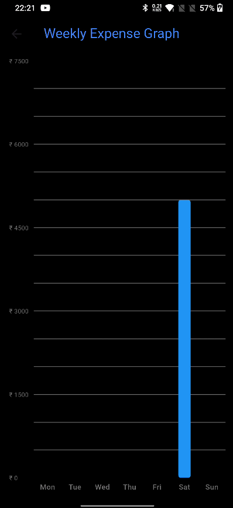

# 💸 Expense Tracker App (Flutter)

A Flutter app to track your daily expenses, set a monthly budget, and view weekly spending in a clean bar chart.

## ✨ Features
- Add, delete daily expenses
- View total balance and monthly budget
- Weekly expense bar chart
- SQLite storage + shared preferences

## 📸 Screenshots

| Home | Chart |
|------|-------|
|  |  |

## 📦 Tech Used
- Flutter
- Dart
- sqflite
- shared_preferences
- fl_chart

## 🚀 Getting Started
